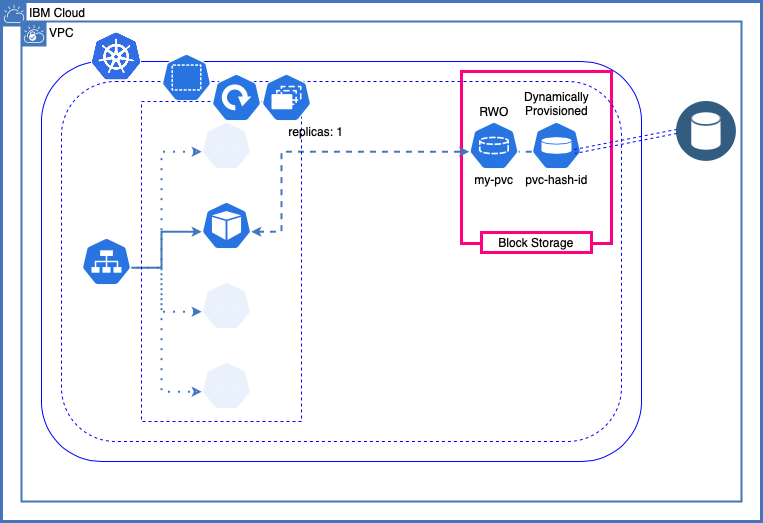

# NFS Provisioner Documentation

- [NFS Provisioner Documentation](#nfs-provisioner-documentation)
  - [Deployments](#deployments)
  - [Usage](#usage)
    - [NFS CustomResource](#nfs-customresource)
      - [Using your own backend block storage](#using-your-own-backend-block-storage)
    - [PersistentVolumeClaim](#persistentvolumeclaim)
    - [Container, Volume & mountVolume](#container-volume--mountvolume)
  - [Architecture](#architecture)
    - [Using a PVC for application storage](#using-a-pvc-for-application-storage)
    - [Using NFS Provisioner for application storage](#using-nfs-provisioner-for-application-storage)
      - [Deployment](#deployment)
      - [StorageClass](#storageclass)
      - [NFS Provisioner PersistentVolumeClaim](#nfs-provisioner-persistentvolumeclaim)
      - [Back Storage PersistentVolumeClaim](#back-storage-persistentvolumeclaim)
    - [Using NFS Provisioner Operator](#using-nfs-provisioner-operator)
      - [Container and Deployment](#container-and-deployment)
      - [Custom Resource Definition](#custom-resource-definition)

The NFS Provisioner Operator allows you to have a volume available to many Pods using the same backend block storage, reducing cost and improving the management of resources. Having the operator deployed you only need to specify the NFS custom resource and a PVC with the required storage specification for your containers.

## Deployments

Before use the NFS **Custom Resource** (CR) to request a NFS storage for your containers you need to deploy the **Operator** and the **Custom Resource Definition** (CRD). The easiest way to do so is executing the following `kubectl` command:

```bash
kubectl create -f https://www.johandry.com/nfs-operator/nfs_provisioner_operator_install.yaml
```

Other way to deploy it, specially if you are developing the NFS Provisioner Operator or using the repository, is to deploy the files located in the `deploy/` directory and the `deploy/crds/*_crd.yaml` file with the CRD. Or, just execute the following `make` command.

```bash
make deploy
```

To verify the NFS Provisioner is ready, execute this.

```bash
kubectl get nfs
```

## Usage

To use the NFS storage in your containers you need two resources: the NFS `CustomResource` (CR) and the `PersistentVolumeClaim` (PVC). Then you can use the PVC from many containers mounting the volume like any other PVC volume.

### NFS CustomResource

A NFS CR may look like this:

```yaml
apiVersion: ibmcloud.ibm.com/v1alpha1
kind: Nfs
metadata:
  name: nfs
  namespace: nfs-test
spec:
  storageClass: ibmcloud-nfs
  provisionerAPI: ibmcloud/nfs
  backingStorage:
    pvcName: nfs-block-custom
```

This CR creates the backend block storage for you with the given storage specification. The NFS service is only available on the Namespace `nfs-test` and any PVC using the storage class `ibmcloud-nfs` will have access to the NFS Service.

#### Using your own backend block storage

The CR can create the backend block storage for you however you can have your own backend block storage accessible through a PVC and specify in the NFS CR to use it.

For example, having the following PVC.

```yaml
apiVersion: v1
kind: PersistentVolumeClaim
metadata:
  name: nfs-block-own
spec:
  storageClassName: ibmc-vpc-block-general-purpose
  accessModes:
    - ReadWriteOnce
  resources:
    requests:
      storage: 10Gi
```

The following NFS CR uses the above PVC as backend block storage.

```yaml
apiVersion: ibmcloud.ibm.com/v1alpha1
kind: Nfs
metadata:
  name: nfs
  namespace: nfs-test-own-storage
spec:
  storageClass: ibmcloud-nfs
  provisionerAPI: ibmcloud/nfs
  backingStorage:
    pvcName: nfs-block-own
```

This offers the same results, the difference is that you own the PVC and have control over it. However, you are in charge of destroying it once it's not in use.

### PersistentVolumeClaim

It may be easy to confuse this `PersistentVolumeClaim` with the previous PVC used for the backend block storage. The previous PVC is optional and consumed by the operator, this PVC is the one to be consumed by your containers or Pods.

The following `PersistentVolumeClaim` named `nfs` is used by your application container or Pod to define and mount a volume.

```yaml
kind: PersistentVolumeClaim
apiVersion: v1
metadata:
  name: nfs
spec:
  storageClassName: ibmcloud-nfs
  accessModes:
    - ReadWriteMany
  resources:
    requests:
      storage: 1Mi
```

Notice you are using the same `storageClassName` you defined in the NFS CRD, in this example it is `ibmcloud-nfs`. The requested storage should be less than the backend block storage size.

### Container, Volume & mountVolume

Once you have application PVC deployed the volume is ready to be consumed by the application container.

Take the following deployment as an example.

```yaml
apiVersion: apps/v1
kind: Deployment
metadata:
  labels:
    app: movies
  name: movies
spec:
  replicas: 4
  selector:
    matchLabels:
      app: movies
  template:
    metadata:
      labels:
        app: movies
    spec:
      volumes:
        - name: movies-volume
          persistentVolumeClaim:
            claimName: nfs
      containers:
        - image: johandry/movies:1.0
          name: movies
          volumeMounts:
            - name: movies-volume
              mountPath: /data
```

The `volume` named `movies-volume` use the PVC previously created, named `nfs`. Then it's mounted into the container/Pod on the `/data` directory, this is done with the `volumeMounts` directive of the container. As you can see there are 4 replicas of this Pod, all of them can access the same PVC and PV, therefore the same backend block storage.

## Architecture

### Using a PVC for application storage

The `PersistentVolumeClaim` available on IBM Cloud Gen 2 - at this time - only allows access mode `ReadWriteOnce` because it's a BlockStorage type volume. There is also a limit of block storages you can have in a VPC, as well as there is a limit of the total volume size requested. You can read more about [IBMCloud VPC Block Storage](https://cloud.ibm.com/docs/containers?topic=containers-vpc-block) in the IBMCloud documentation site.

In a regular application you may have a deployment with multiple replicas of your Pod or containerized application. If your application needs an external storage you can provide it with a PVC using a external provisioner. The limitation, as mentioned above, is that this PVC is RWO and cannot be used by multiple containers restricting the number of replicas or containers to just one.



This is a simple example of the PVC and the deployment.

```yaml
apiVersion: v1
kind: PersistentVolumeClaim
metadata:
  name: movies
spec:
  storageClassName: ibmc-vpc-block-general-purpose
  accessModes:
    - ReadWriteOnce
  resources:
    requests:
      storage: 1Gi
---
apiVersion: apps/v1
kind: Deployment
metadata:
  labels:
    app: movies
  name: movies
spec:
  replicas: 1
  selector:
    matchLabels:
      app: movies
  template:
    metadata:
      labels:
        app: movies
    spec:
      volumes:
        - name: movies-volume
          persistentVolumeClaim:
            claimName: movies
      containers:
        - image: us.icr.io/iac-registry/movies:1.1
          name: movies
          volumeMounts:
            - name: movies-volume
              mountPath: "/data"
```

The `PersistentVolume` is [dynamically provisioned](https://kubernetes.io/blog/2017/03/dynamic-provisioning-and-storage-classes-kubernetes/), this means it's created by demand. The developer only needs to create the PVC using a predefined StorageClass that is used by a Provisioner to create the volume. The `StorageClass` `ibmc-vpc-block-general-purpose` and others can be found in the [IBMCloud VPC Block Storage](https://cloud.ibm.com/docs/containers?topic=containers-vpc-block) documentation.

As a side note, even if the application needs and request 1Gb of storage the minimum provided size is 10Gb. A more complex and detailed example can be found in the [IBM Cloud Containers Patterns](https://ibm.github.io/cloud-enterprise-examples/iac-resources/container#persistent-volumes)

There are multiple solutions to this problem. For example, to use [StatefulSet](https://kubernetes.io/docs/concepts/workloads/controllers/statefulset/) using `volumeClaimTemplates` which will create a `PersistentVolume` for every replica provisioned by a **PersistentVolume Provisioner**.

### Using NFS Provisioner for application storage

Other solution is to use a [External Storage Provisioners](https://github.com/kubernetes-incubator/external-storage). There are many external provisioners such as NFS, EFS, Local Volume, and many others maintained by the community. There is also a [library](https://github.com/kubernetes-sigs/sig-storage-lib-external-provisioner) to create your own [external provisioner](https://kubernetes.io/docs/concepts/storage/storage-classes/#provisioner).

The following diagram shows how to use the NFS Provisioner to allow multiple containers to read from a `ReadWriteMany` PVC. This PVC is managed by the NFS Provisioner exposing a NFS Service and this NFS uses a backend storage that you should previously create. The backend storage is accessible through a `PersistentVolumeClaim`, in this example, it's the previously created IBMCloud VPC Block Storage.


The NFS Provisioner consist of a **Deployment**, **Service** to allow external resources to access the container NFS service, a **PVC** to access backend storage (if any), **ServiceClass**, **Service Account**, **Roles** and **RoleBinding** (cluster and namespaced) to manage RBAC security. All these files are in the `test/kubernetes/nfs-provisioner` directory of the [GitHub repo](https://github.com/johandry/nfs-operator/tree/master/test/kubernetes/nfs-provisioner) but here are segments of code of some of them.

The NFS External Provisioner, like any other external provisioner, is a dynamic `PersistentVolume` provisioner. A `StorageClass` is defined to be its `provisioner`, the created instance then watch for `PersistentVolumeClaims` asking for this `StorageClass` to automatically create the `PersistentVolume` for the user resource.

#### Deployment

This deployment has one replica of a container running the image `quay.io/kubernetes_incubator/nfs-provisioner` which serve the NFS service.

```yaml
kind: Deployment
apiVersion: apps/v1
metadata:
  name: nfs-provisioner
spec:
  selector:
    matchLabels:
      app: nfs-provisioner
  replicas: 1
  strategy:
    type: Recreate
  template:
    metadata:
      labels:
        app: nfs-provisioner
    spec:
      serviceAccount: nfs-provisioner
      containers:
        - name: nfs-provisioner
          # Container that serving the NFS service
          image: quay.io/kubernetes_incubator/nfs-provisioner:latest
          ports:
            # List of ports related to NFS service
            ...
          securityContext:
            capabilities:
              add:
                - DAC_READ_SEARCH
                - SYS_RESOURCE
          args:
            # Name of the provisioner defined in the StorageClass
            - "-provisioner=ibmcloud/nfs"
          env:
            - name: POD_IP
              valueFrom:
                fieldRef:
                  fieldPath: status.podIP
            - name: SERVICE_NAME
              value: nfs-provisioner
            - name: POD_NAMESPACE
              valueFrom:
                fieldRef:
                  fieldPath: metadata.namespace
          imagePullPolicy: "IfNotPresent"
          volumeMounts:
            - name: export-volume
              mountPath: /export
      volumes:
        - name: export-volume
          persistentVolumeClaim:
            # Name of the PersistentVolumeClaim previously created
            claimName: nfs-block-custom
```

#### StorageClass

The NFS Provisioner will monitor for any PVC request using this StorageClass. The StorageClasses are required for [Dynamic Provisioning](https://kubernetes.io/blog/2017/03/dynamic-provisioning-and-storage-classes-kubernetes/).

```yaml
kind: StorageClass
apiVersion: storage.k8s.io/v1
metadata:
  name: ibmcloud-nfs
provisioner: ibmcloud/nfs
mountOptions:
  - vers=4.1
```

#### NFS Provisioner PersistentVolumeClaim

Do not confuse this PVC withe the PVC used for Backend Storage. This is the PVC to use the NFS volume expose by the containers. This example PVC only request 1Mb of the NFS storage.

```yaml
kind: PersistentVolumeClaim
apiVersion: v1
metadata:
  name: nfs
spec:
  storageClassName: ibmcloud-nfs
  accessModes:
    - ReadWriteMany
  resources:
    requests:
      storage: 1Mi
```

#### Back Storage PersistentVolumeClaim

This is the PVC used by the container to use as volume for the NFS service. This should be the first resource to create and last to delete. If you want to reuse the files and data stored by the containers make sure to create a backup, snapshot or do not delete it. This PVC request 10Gb from the volume, there will be plenty of storage if the containers use just 1Mb.

```yaml
apiVersion: v1
kind: PersistentVolumeClaim
metadata:
  name: movies
spec:
  storageClassName: ibmc-vpc-block-general-purpose
  accessModes:
    - ReadWriteOnce
  resources:
    requests:
      storage: 10Gi
```

### Using NFS Provisioner Operator

To use the NFS Provisioner you need to create several resources, so wouldn't be nice to have an operator to manage everything for you?

This operator deploy all the resources previously mentioned to have a backend storage and the NFS Provisioner. So, you only need to deploy the operator when the cluster is created, then use the `nfs` custom resource and a PVC to request storage for your containers, as many as you want.


The operator, like most of the operators, is formed by a **Container** and a **Deployment** to have this containerized operator running in the cluster, also a set of resources to setup RBAC for the operator and the **Custom Resource Definition** to define the Nfs resource.

To use the operator you need the **NFS Custom Resource** and a **PVC** to request storage from the NFS Provisioner.

#### Container and Deployment

The operator application is containerized and available on any reachable Container Registry, in this case we use DockerHub and it's available on `docker.io/johandry/nfs-operator`. The operator application is the one that deploy or creates all the required resources mentioned before. The operator, among other things, is watching all the resources regularly and keep them with the defined specifications.

The deployment only has one replica and it's used to have the operator container running on the cluster. The deployment can be view at `deploy/operator.yaml` in the [GitHub repo](https://github.com/johandry/nfs-operator/tree/master/deploy).

#### Custom Resource Definition

The Custom Resource Definition (CRD) allow us to define the **Nfs** object to be used like any other Kubernetes object. The CRD can be found in the `deploy/crds/*_nfs_crd.yaml` in the [GitHub repo](https://github.com/johandry/nfs-operator/tree/master/deploy/crds).

**Custom Resource** and **PersistentVolumeClaim**

Once the CRD is created the Nfs object kind can be used by the kubernetes developer or admin using a **Custom Resource** file. The CR is defined in the `pkg/apis/ibmcloud/v1alpha1/nfs_types.go` file in the `NfsSpec` struct.

A demo for a NFS CR would be like the following.

```yaml
apiVersion: ibmcloud.ibm.com/v1alpha1
kind: Nfs
metadata:
  name: nfs
  namespace: nfs-test
spec:
  storageClass: ibmcloud-nfs
  provisionerAPI: ibmcloud/nfs
  backingStorage:
    pvcName: nfs-block-custom
```

Creating this CR allow us to claim a volume using the `storageClassName` **ibmcloud-nfs**
